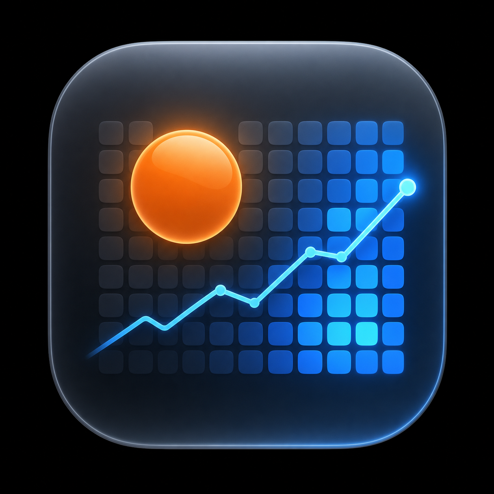

# Codex Token Dashboard

<p align="center">
  
</p>

A local-first macOS SwiftUI app for visualizing Codex token usage from local session logs.

## Install

Recommended one-line install:

```bash
curl -fsSL https://raw.githubusercontent.com/hututuo/codex-token-dashboard/main/install.sh | bash
```

The installer downloads the latest `.app.zip` release, unpacks it, installs the app into `/Applications` when writable or `~/Applications` otherwise, removes the common `com.apple.quarantine` flag, and opens the app.

This helps avoid the common macOS "app is damaged and can't be opened" message caused by browser-downloaded unsigned apps being quarantined. It is not a full replacement for Apple Developer ID signing and notarization. Company MDM, security software, or stricter macOS policy can still block unsigned apps.

## What It Does

- Auto-detects local Codex data from a saved directory, `CODEX_HOME`, `~/.codex`, `~/.config/codex`, or one-level home-directory candidates.
- Reads local Codex `token_count` events from `sessions/**/*.jsonl`.
- Summarizes token usage, calls, streaks, peak usage, and thread count.
- Shows the active data source in the header and provides a fallback directory picker.
- Shows a profile-style yearly heatmap with nearest-cell hover details.
- Heatmap modes use clear metrics: daily totals, calendar-week totals, or cumulative totals through the selected day.
- Shows recent 24-hour token and request activity at 30-minute granularity, with hover details for each time point.
- Refreshes automatically every minute and also provides a manual refresh button.
- Exports a shareable PNG snapshot and CSV summary.

## Privacy

The MVP reads local files only. It does not upload logs, prompts, outputs, or account data.

## Data Sources

The app treats a Codex Home directory as a folder containing:

```text
sessions/
state_5.sqlite
```

`sessions/` is used for precise token-count events. `state_5.sqlite` is used as fallback metadata when available.

## Run

For contributors who want to run from source:

```bash
swift run CodexTokenDashboard
```

## Package A Local App

```bash
chmod +x scripts/package_app.sh
scripts/package_app.sh debug
open "dist/Codex Token Dashboard.app"
```

## Notes

This project intentionally starts as a Swift Package so contributors can build it without an Xcode project. A signed `.app` wrapper can be added later.

## License

MIT
